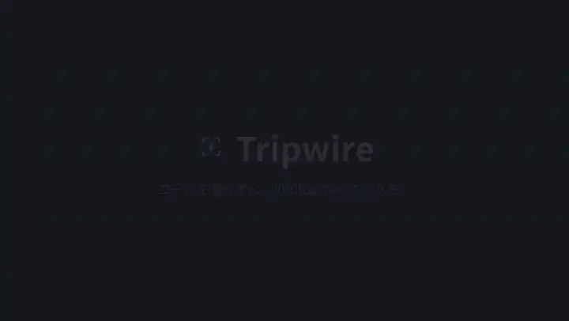
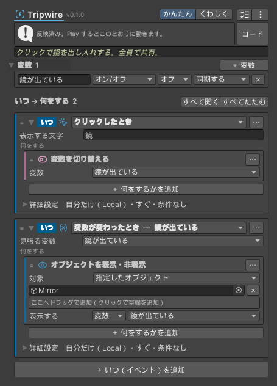

# Tripwire

[English](README.md) ・ [マニュアル](https://haru0416-dev.github.io/tripwire/)

Tripwire は、VRChat ワールドのギミックを Inspector で組み立てるための Unity エディタ拡張です。「いつ」と「何をする」を一覧から選んで並べると、UdonSharp のスクリプトに変換して Udon で動かします。プログラムを書かずにギミックを作れた CyanTrigger の更新が止まったので、その代わりになるものとして作り始めました。

CyanTrigger とは別に一から書いたもので、CyanTrigger のコードは使っていません。

<a href="https://haru0416-dev.github.io/tripwire/"></a>



クリックすると、全員の画面で鏡が出たり消えたりするスイッチです。カード 2 枚と変数 1 つで、あとから来た人にも同じ状態が届きます。このトリガーは、Play やビルドの前に次の UdonSharp に変換されます（変数名を mirrorOn にした場合）。

<details>
<summary>変換された UdonSharp</summary>

```csharp
[UdonBehaviourSyncMode(BehaviourSyncMode.Manual)]
public class Tripwire_85ed20d2b19ec6e8 : UdonSharpBehaviour
{
    [UdonSynced] public bool v_mirrorOn = false;
    bool tw_Prev_mirrorOn = false;
    public UnityEngine.GameObject tw_A1_0_targets;

    public override void Interact()
    {
        {
            Tw_Set_mirrorOn(!v_mirrorOn);
        }
    }

    void Tw_Set_mirrorOn(bool value)
    {
        if (v_mirrorOn == value) return;
        if (!Networking.IsOwner(gameObject)) Networking.SetOwner(Networking.LocalPlayer, gameObject);
        v_mirrorOn = value;
        tw_Prev_mirrorOn = value;
        RequestSerialization();
        Tw_Changed_mirrorOn();
    }

    void Tw_Changed_mirrorOn()
    {
        {
            if (Utilities.IsValid(tw_A1_0_targets)) tw_A1_0_targets.SetActive(v_mirrorOn);
        }
    }

    public override void OnDeserialization()
    {
        if (v_mirrorOn != tw_Prev_mirrorOn)
        {
            tw_Prev_mirrorOn = v_mirrorOn;
            Tw_Changed_mirrorOn();
        }
    }
}
```

</details>

## 作れるギミックの例

- 鍵の扉: 鍵を拾った人がクリックすると開き、持っていない人には「鍵が必要です」と出す
- スコアボード: ボタンを押すたびに数を足して、`スコア: {score}点` と看板に出す（全員で共有し、あとから入った人にも届く）
- 点滅するライト: 3〜6 秒のランダムな間隔で表示を切り替え、スイッチで止める
- サイコロ: 1〜6 のランダムな数を出して、出た目ごとに別のアニメーションを流す
- 一斉に点くランプ: リストに入れたオブジェクトを、ボタン 1 つでまとめて表示する
- シアター: ボタンごとに決めた URL を ProTV や VRChat の動画プレイヤーで流し、再生が始まったら照明を消す
- MIDI の鍵盤: 押した鍵盤の番号で音を選んで鳴らす

どれも「いつ」と「何をする」の組み合わせで作れて、スクリプトを書く必要はありません。

## できること

### いつ（イベント）

クリック、範囲に入った・出た、ピックアップを持った・使った、プレイヤーが入ってきた、UI のボタン・トグル・スライダー、動画の再生といったよく使うもののほかに、UdonSharp で使えるイベントはほぼすべて選べます。当たり判定（2D やパーティクルも）、毎フレーム、ボタンや移動の入力、MIDI、アバターのコンタクトと PhysBone、同期データの受信、Web からの文字や画像の読み込み、ストアの購入などです。

イベントが持つ値（入ってきたプレイヤー、ぶつかった物、押した鍵盤の番号など）は、そのままアクションの対象や値に使えます。

### 何をする（アクション）

表示の切り替え、移動、Animator、音とパーティクル、文字の書き換え、テレポートと移動速度、ピックアップ、動画プレイヤーの操作、変数の変更をよく使う形で用意しています。

一覧にない操作は、Udon から使えるメソッドとプロパティを検索して選べば呼べます。ほかの UdonSharp スクリプトの関数を呼ぶこともできます。

### 流れの組み立て

If で、条件に合うとき（Then）と合わないとき（Else）で別の動きにできます。Else If も使え、入れ子にもできます。条件は「すべて満たす / どれか 1 つ満たす」と「〜でないとき」を選べます。

ループは、決めた回数（Repeat）、リストの中身ごと（For Each）、条件を満たす間（While）の 3 種類です。途中で抜けたり（Break）、次の回へ進んだり（Continue）、イベントをそこで終えたり（Return）もできます。

タイマーは決めた秒数ごと（または一度だけ）に動き、間隔をランダムにもできます。アクションから始めたり止めたりでき、ほかにもイベントを数秒遅らせたり、名前を付けたイベントをほかのトリガーやスクリプトから呼んだりできます。

### 変数と同期

変数には、オン/オフ、数、文字、オブジェクト、プレイヤー、リストなど、Udon で扱える型を使えます。「同期する」にした変数の値は、あとから入った人も含めて全員に届きます。値が変わったときに動くイベントもあるので、同期したスイッチに合わせてライトを切り替える、といった使い方ができます。文字の中に `{score}` のように書くと、変数の値が入ります。

### 作りやすさ

設定に問題があるカードは赤（エラー）かオレンジ（注意）の枠になり、カードの中に理由が出ます。同期した変数を全員で同時に変えてしまう、毎フレームのイベントをネットワークで送ってしまう、といった VRChat でつまずきやすい組み合わせにも注意が出ます。

カードはドラッグで並べ替えられ、コピーと貼り付け、メモ、よく使う項目のお気に入りもあります。表示は日本語と英語を切り替えられ、Udon での名前（`OnPlayerTriggerEnter` など）も並べて出します。

生成されるのは普通の UdonSharp のコードなので、VRChat に Tripwire 専用のしくみを入れる必要はありません。

### ほかのアセットとの連携

ProTV、VizVid、USharpVideo、VideoTXL は、再生や停止などの通知を受け取るイベントと、よく使う操作を一覧から選べます。

## 動かす環境

Unity 2022.3 と VRChat Worlds SDK 3.10.5 以降で動きます。

## 入れ方

VCC(または ALCOM)から入れます。

1. [vpm.haru0416.dev](https://vpm.haru0416.dev) を開き、「VCC に追加」を押します(Settings → Packages → Add Repository に `https://vpm.haru0416.dev/index.json` を入れても同じです)
2. ワールドのプロジェクトの Manage Project で Tripwire を追加します。Tripwire が使う Udon Bridge も一緒に入ります
3. Unity の Add Component に「Tripwire > Tripwire Trigger」が出れば入っています

## 使い方

1. ギミックにしたいオブジェクトに Tripwire Trigger を付けます
2. 「＋ いつ（イベント）を追加」で、きっかけになる出来事を選びます
3. 「＋ 何をするかを追加」で、起きたときの動きを選び、対象のオブジェクトをドラッグで入れます
4. Play を押すと、変換したスクリプトで動きます

変換は Play とビルドの前に自動で行います。すぐ反映したいときは Inspector 上部の「今すぐ反映」を押してください。

変換したスクリプトは `Assets/TripwireGenerated` に置かれます。このフォルダは消さずに、.meta ファイルごとバージョン管理に入れてください。シーンのコンポーネントはこのファイルを指していて、作り直したファイルはシーンから見ると別のものになります。

表示言語は Unity エディターの言語に合わせて始まります。「Tools > Tripwire > 表示言語 Language」で日本語と英語を切り替えられます。

## 更新と困ったとき

更新は VCC で新しい版を選ぶだけです。古い版で保存したトリガーも、そのまま読めます。

反映できないときは、トリガーの Inspector の上に理由と直し方が出ます。プロジェクトのほかのスクリプトのエラーで止まっているときも、そのファイル名が出ます。解決しないときや不具合を見つけたときは、[GitHub の Issue](https://github.com/haru0416-dev/tripwire/issues) か、Inspector の ⋮ →「不具合を報告」から知らせてください。

## まだできていないこと

VRChat の実機での確認は、まだ十分にできていません。とくに入力、アバター、ストアのイベントは、Unity 上ではコンパイルが通ることしか確かめていません。不具合があれば Issue で教えてください。

YamaPlayer と QvPen は、通知を受け取るのに専用の基底クラスが必要なので、まだ対応していません。iwaSync3 は現行版のソースが公開されていないので、連携の一覧に入れていません。

## 支援

Tripwire は無料です。気に入ったら [BOOTH](https://haru-dev.booth.pm/items/8959507) で支援してもらえると、開発の励みになります。

## ライセンス

MIT ライセンスです（[LICENSE](LICENSE)）。ProTV などほかのアセットのコードは含んでいません。連携の一覧には、それぞれの公開されている関数名と引数の形だけを載せています。
