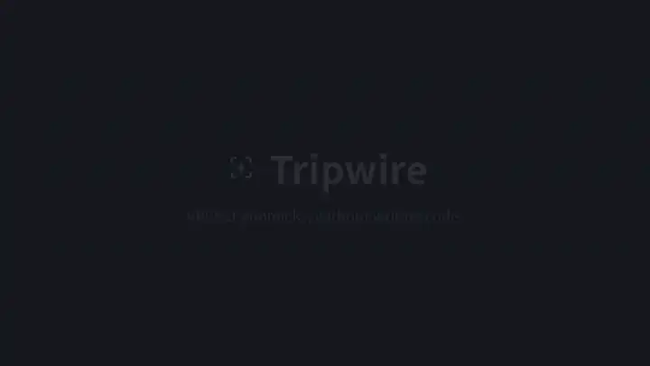
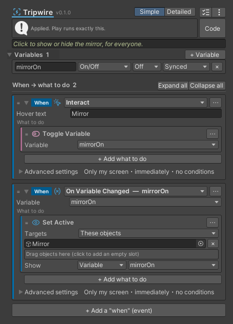

# Tripwire

[日本語](README.ja.md) · [Manual](https://haru0416-dev.github.io/tripwire/en/)

Tripwire is a Unity editor extension for building VRChat world gimmicks in the Inspector. You pick "when" (an event) and "what to do" (actions) from lists, and Tripwire turns them into UdonSharp scripts that run on Udon. It started as a replacement for CyanTrigger, which let people make gimmicks without writing code and is no longer updated.

Tripwire is written from scratch and contains no CyanTrigger code.

<a href="https://haru0416-dev.github.io/tripwire/en/"></a>



A switch that shows or hides a mirror for everyone when clicked: two cards and one variable, and players who join later see the same state. Before Play and builds, the trigger becomes this UdonSharp:

<details>
<summary>The generated UdonSharp</summary>

```csharp
[UdonBehaviourSyncMode(BehaviourSyncMode.Manual)]
public class Tripwire_85ed20d2b19ec6e8 : UdonSharpBehaviour
{
    [UdonSynced] public bool v_mirrorOn = false;
    bool tw_Prev_mirrorOn = false;
    public UnityEngine.GameObject tw_A1_0_targets;

    public override void Interact()
    {
        {
            Tw_Set_mirrorOn(!v_mirrorOn);
        }
    }

    void Tw_Set_mirrorOn(bool value)
    {
        if (v_mirrorOn == value) return;
        if (!Networking.IsOwner(gameObject)) Networking.SetOwner(Networking.LocalPlayer, gameObject);
        v_mirrorOn = value;
        tw_Prev_mirrorOn = value;
        RequestSerialization();
        Tw_Changed_mirrorOn();
    }

    void Tw_Changed_mirrorOn()
    {
        {
            if (Utilities.IsValid(tw_A1_0_targets)) tw_A1_0_targets.SetActive(v_mirrorOn);
        }
    }

    public override void OnDeserialization()
    {
        if (v_mirrorOn != tw_Prev_mirrorOn)
        {
            tw_Prev_mirrorOn = v_mirrorOn;
            Tw_Changed_mirrorOn();
        }
    }
}
```

</details>

## Gimmicks you can build

- A locked door: opens for a player who picked up the key, and shows "You need the key" to everyone else
- A scoreboard: each button press adds a point and shows `Score: {score}` on a sign (shared by everyone, late joiners included)
- A flickering light: toggles at random intervals of 3 to 6 seconds, until a switch stops it
- Dice: rolls 1 to 6 and plays a different animation for each result
- Lamps that light up together: one button shows every object in a list
- A theater: each button plays its URL on ProTV or a VRChat video player, and the lights dim when the video starts
- A MIDI keyboard: the key number picks which sound to play

Each of these is a set of "when" and "what to do" cards; no script to write.

## What it does

### When (events)

Besides the common ones (interact, entering and leaving an area, picking up and using a pickup, players joining, UI buttons, toggles and sliders, video playback), almost every event UdonSharp offers is available: collisions and triggers (2D and particles too), every frame, button and movement input, MIDI, avatar contacts and PhysBones, receiving sync, loading text and images from the web, store purchases and more.

The values an event brings (the player who entered, what hit the object, the MIDI key number...) can be used directly as targets and values in actions.

### What to do (actions)

Ready-made actions cover showing and hiding, moving, Animator parameters, sound and particles, text, teleporting and walk speed, pickups, video players, variables and calculations, and getting components.

For anything else, search the methods and properties Udon exposes and pick one to call, including ones with `out` parameters (received by variables) and ones that report back to the trigger's events, such as loading text or images from the web. Methods of your own UdonSharp scripts can be called too.

### Flow

"If" runs some actions when its conditions hold (Then) and others when they don't (Else); Else If chains further conditions. Blocks nest, and conditions can require all or any one of them, each optionally negated.

Loops run a number of times (Repeat), once per item of a list (For Each) or while conditions hold (While). Break leaves a loop, Continue skips to its next round, and Return ends the event.

Timers run every few seconds (or once), optionally at random intervals, and actions can start and stop them. Events can also be delayed by a few seconds, and named events can be called from other triggers and scripts.

### Variables and sync

Variables can hold any type Udon can: on/off, numbers, text, objects, players, lists and more. A synced variable reaches every player, including those who join later, and an "On Variable Changed" event lets a synced switch drive a light on every screen. Text can include variable values, such as `Score: {score}`.

### Made to be easy to get right

A card with a problem gets a red (error) or orange (warning) frame with the reason inside. Tripwire also warns about combinations that commonly go wrong in VRChat, such as everyone changing a synced variable at once or sending a per-frame event over the network.

Cards can be reordered by dragging, copied and pasted, and annotated; frequently used items can be starred. The editor speaks Japanese and English and shows the Udon names (`OnPlayerTriggerEnter` and so on) next to each item.

The output is plain UdonSharp, so nothing Tripwire-specific has to exist in VRChat.

### Other assets

For ProTV, VizVid, USharpVideo and VideoTXL, the notifications they send (play, stop and so on) and their common operations can be picked from lists.

## Requirements

Unity 2022.3 and VRChat Worlds SDK 3.10.5 or later.

## Installing

Through VCC (or ALCOM):

1. Open [vpm.haru0416.dev](https://vpm.haru0416.dev) and press "Add to VCC" (or add `https://vpm.haru0416.dev/index.json` under Settings → Packages → Add Repository)
2. In your world project's Manage Project, add Tripwire. Udon Bridge, which it uses, comes with it
3. In Unity, "Tripwire > Tripwire Trigger" appears under Add Component

## Using it

1. Add a Tripwire Trigger to the object that should become a gimmick
2. Click "+ Add a "when" (event)" and choose what starts it
3. Click "+ Add what to do", choose what happens, and drag in the target objects
4. Press Play; the generated script runs

Tripwire converts the triggers automatically before Play and before builds; "Apply now" at the top of the Inspector does it right away.

Generated scripts go to `Assets/TripwireGenerated`. Keep the folder, and commit it to version control with its .meta files: the scene's components point at those files, and recreated ones would be new files the scene doesn't know.

The editor language starts out as Unity's own; switch between Japanese and English under "Tools > Tripwire > 表示言語 Language".

## Updating and getting help

To update, pick the new version in VCC. Triggers saved by older versions keep working.

When a trigger can't be applied, its Inspector says why and how to fix it, also when another script in the project stops the compile (it names the file). For anything else, or a bug, open a [GitHub issue](https://github.com/haru0416-dev/tripwire/issues), or use ⋮ → "Report a problem" in the Inspector.

## Not done yet

Testing in the VRChat client has been limited so far; the input, avatar and store events in particular have only been checked to compile. Please report problems as issues.

YamaPlayer and QvPen need listeners to derive from their own base classes, which Tripwire does not generate yet. iwaSync3 is not in the asset list because the source of its current version is not public.

## Support

Tripwire is free. If you like it, you can support its development on [BOOTH](https://haru-dev.booth.pm/items/8959507).

## License

MIT ([LICENSE](LICENSE)). No code from ProTV or the other assets is included; the asset lists only hold the public method names and parameter shapes.

The category, event and action icons are from [Lucide](https://lucide.dev) (ISC, see `Editor/Icons/LUCIDE-LICENSE.txt` in the package).
